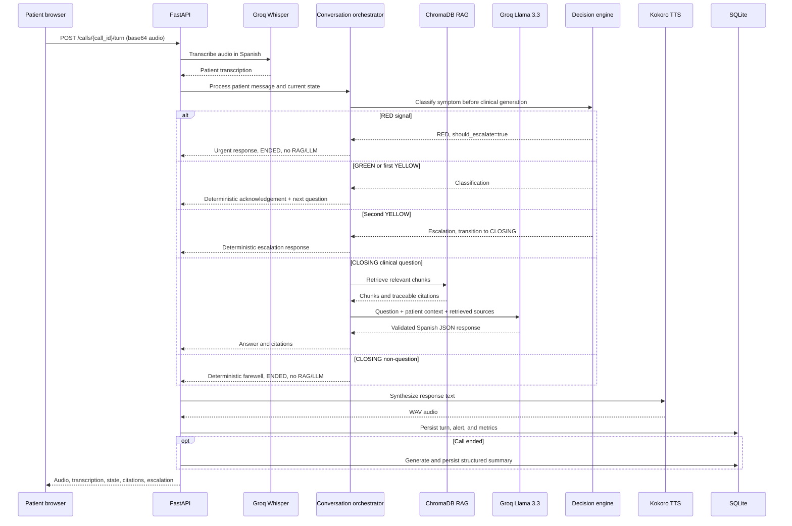
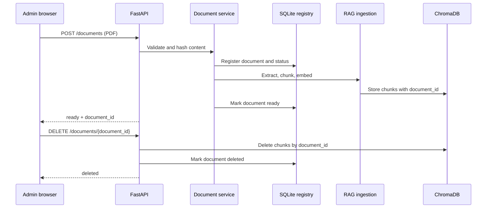
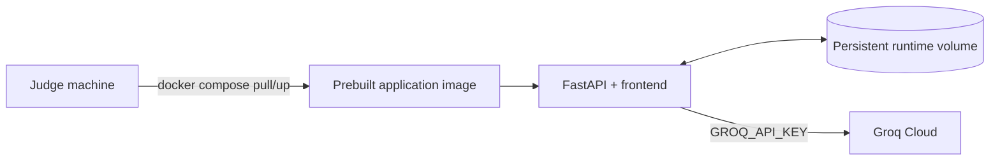

# Architecture Diagram

## Runtime Architecture

```mermaid
flowchart TB
    Browser[Browser]

    subgraph Frontend[Browser Frontend]
        CallUI[Call interface<br/>MediaRecorder + WAV playback]
        AdminUI[Administration console<br/>upload, list, delete]
        MetricsUI[Metrics view]
    end

    subgraph App[FastAPI Modular Monolith]
        API[API routers]
        Calls[Voice call endpoints<br/>POST /calls<br/>POST /calls/{id}/turn]
        Documents[Document lifecycle<br/>POST/GET/DELETE /documents]
        RAGAPI[RAG query endpoint<br/>POST /rag/query]
        MetricsAPI[Metrics reporting API]

        Conversation[Conversation orchestrator<br/>state, history, patient context]
        Decision[Deterministic escalation engine<br/>GREEN / YELLOW / RED]
        RAG[RAG engine<br/>retrieve chunks + citations]
        LLM[Groq Llama 3.3 70B adapter<br/>structured JSON + safety validation]
        Voice[Voice adapters]
        STT[Groq Whisper Large V3]
        TTS[Kokoro ef_dora]
        Summary[Structured summary generator]
        Metrics[Metrics collector<br/>latency, tokens, cost]
        Persistence[Persistence layer]
    end

    subgraph Storage[Runtime Storage]
        SQLite[(SQLite<br/>calls, turns, summaries,<br/>alerts, documents)]
        Chroma[(ChromaDB<br/>chunks, embeddings,<br/>source metadata)]
        Uploads[(Uploaded PDFs)]
    end

    Groq[Groq Cloud]

    Browser --> CallUI
    Browser --> AdminUI
    Browser --> MetricsUI

    CallUI --> Calls
    AdminUI --> Documents
    MetricsUI --> MetricsAPI

    Calls --> Voice
    Voice --> STT
    Voice --> TTS
    STT --> Groq
    LLM --> Groq

    Calls --> Conversation
    Conversation -->|QUESTIONS: classify first| Decision
    Conversation -->|CLOSING clinical question only| RAG
    RAG -->|sufficient context only| LLM
    Calls --> Summary
    Calls --> Metrics
    Calls --> Persistence

    RAGAPI --> RAG
    RAGAPI -->|sufficient context only| LLM
    Documents --> Uploads
    Documents --> RAG
    Documents --> Persistence
    MetricsAPI --> Metrics

    RAG --> Chroma
    Persistence --> SQLite
    Persistence --> Chroma
    Summary --> SQLite
    Metrics --> SQLite
```

## Voice Turn Flow



## Document Lifecycle



## Deployment Shape

The current application is a single FastAPI modular monolith. Docker distribution is
intended to provide a prebuilt image containing the application, dependencies, BGE-M3
cache, and pre-indexed corpus. Runtime secrets such as `GROQ_API_KEY` are injected by
the environment and are never included in the image.


