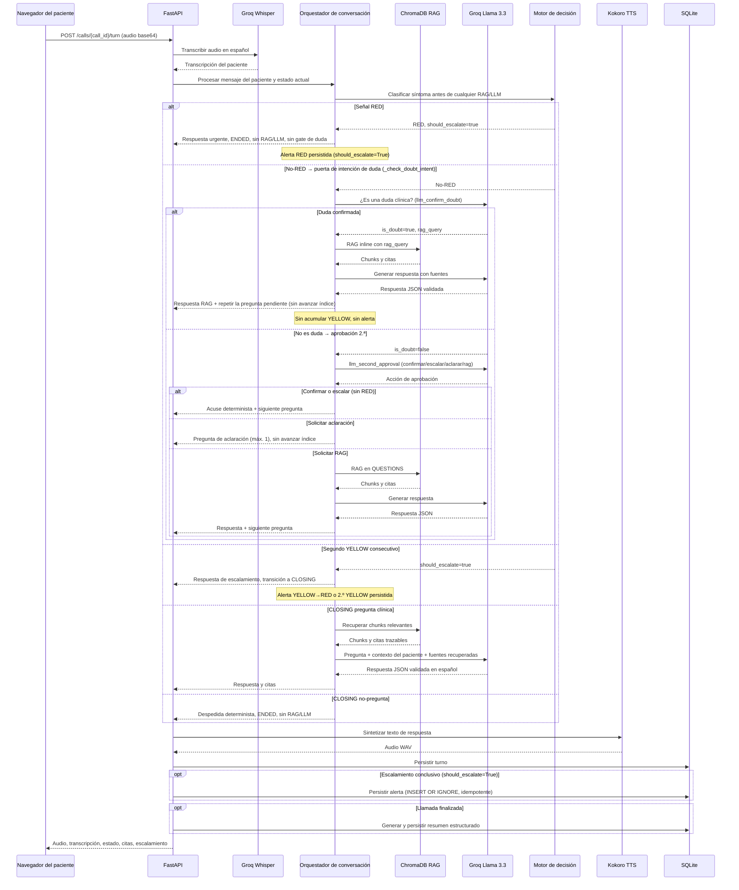
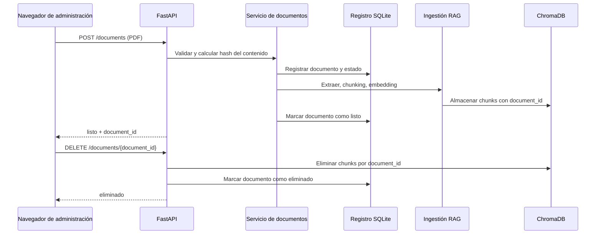
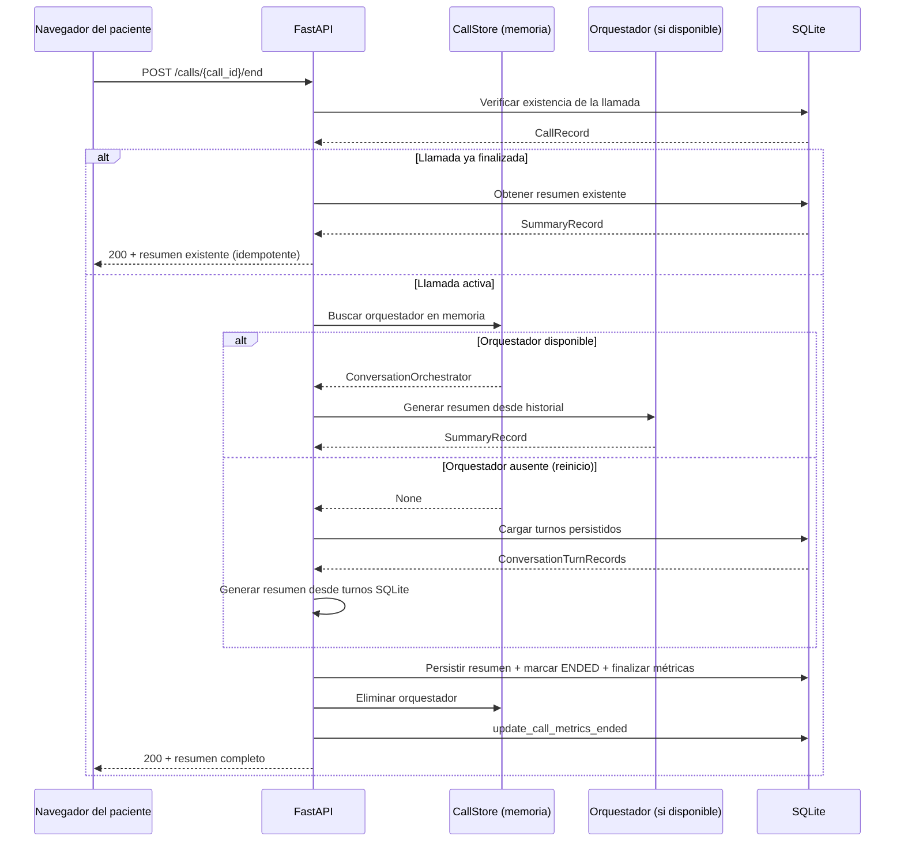
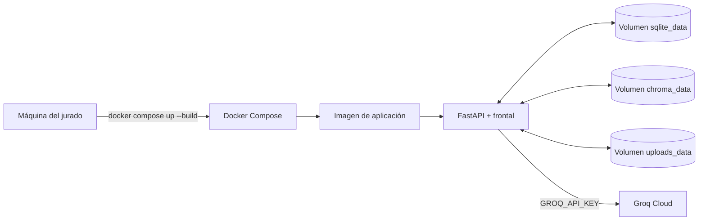

# Diagrama de arquitectura

## Arquitectura en tiempo de ejecución

```mermaid
flowchart TB
    Browser[Navegador]

    subgraph Frontend[Frontal del navegador]
        CallUI[Interfaz de llamada<br/>MediaRecorder + reproducción WAV]
        AdminUI[Consola de administración<br/>cargar, listar, eliminar]
        MetricsUI[Vista de métricas]
    end

    subgraph App[Monolito modular FastAPI]
        API[Routers de API]
        Calls[Endpoints de llamadas de voz<br/>POST /calls<br/>POST /calls/{id}/turn<br/>POST /calls/{id}/end]
        Documents[Ciclo de vida de documentos<br/>POST/GET/DELETE /documents<br/>POST /documents/reconcile]
        RAGAPI[Endpoint de consulta RAG<br/>POST /rag/query]
        MetricsAPI[API de reporte de métricas]

        Conversation[Orquestador de conversación<br/>estado, historial, contexto del paciente]
        Decision[Motor de escalamiento determinista<br/>GREEN / YELLOW / RED]
        RAG[Motor RAG<br/>recuperar chunks + citas]
        LLM[Adaptador Groq Llama 3.3 70B<br/>JSON estructurado + validación de seguridad]
        Voice[Adaptadores de voz]
        STT[Groq Whisper Large V3]
        TTS[Kokoro ef_dora]
        Summary[Generador de resúmenes estructurados]
        Metrics[Colector de métricas<br/>latencia, tokens, costo]
        Persistence[Capa de persistencia]
    end

    subgraph Storage[Almacenamiento en ejecución]
        SQLite[(SQLite<br/>llamadas, turnos, resúmenes,<br/>alertas, documentos)]
        Chroma[(ChromaDB<br/>chunks, embeddings,<br/>metadatos de fuente)]
        Uploads[(PDFs cargados)]
    end

    Groq[Groq Cloud]

    Browser --> CallUI
    Browser --> AdminUI
    Browser --> MetricsUI

    CallUI --> Calls
    AdminUI --> Documents
    MetricsUI --> MetricsAPI

    Calls --> Voice
    Voice --> STT
    Voice --> TTS
    STT --> Groq
    LLM --> Groq

    Calls --> Conversation
    Conversation -->|QUESTIONS: clasificar → RED cortocircuito| Decision
    Conversation -->|no-RED: gate de duda| LLM
    Conversation -->|duda confirmada → RAG inline| RAG
    Conversation -->|no-RED no-duda: aprobación 2.ª| LLM
    Conversation -->|CLOSING: pregunta clínica| RAG
    RAG -->|solo contexto suficiente| LLM
    Calls --> Summary
    Calls --> Metrics
    Calls --> Persistence

    RAGAPI --> RAG
    RAGAPI -->|solo contexto suficiente| LLM
    Documents --> Uploads
    Documents --> RAG
    Documents --> Persistence
    MetricsAPI --> Metrics

    RAG --> Chroma
    Persistence --> SQLite
    Persistence --> Chroma
    Summary --> SQLite
```

## Flujo de turno de voz

> **Nota:** La clasificación determinista de síntomas (GREEN / YELLOW / RED) ocurre
> antes de cualquier gate de duda o invocación LLM. Una clasificación RED cortocircuita
> directamente a escalamiento sin pasar por el gate de duda ni consultar modelos.



## Ciclo de vida de documentos



## Finalización manual de llamada



## Forma de despliegue

La aplicación se distribuye como un monolito modular FastAPI en una imagen Docker. Docker
Desktop o Docker Engine con Compose ejecuta Uvicorn en `0.0.0.0:8000`, sin reload, y
permite configurar el puerto del host mediante `APP_PORT`. Los secretos de ejecución como
`GROQ_API_KEY` se inyectan desde `.env` y nunca se incluyen en la imagen. BGE-M3 se
descarga y carga bajo demanda en la primera operación RAG; su caché puede perderse al
eliminar el contenedor.


