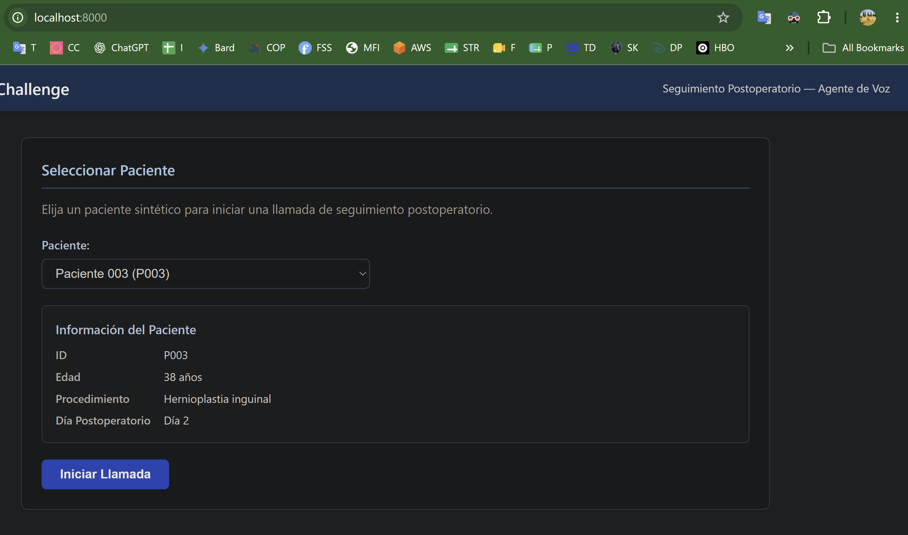
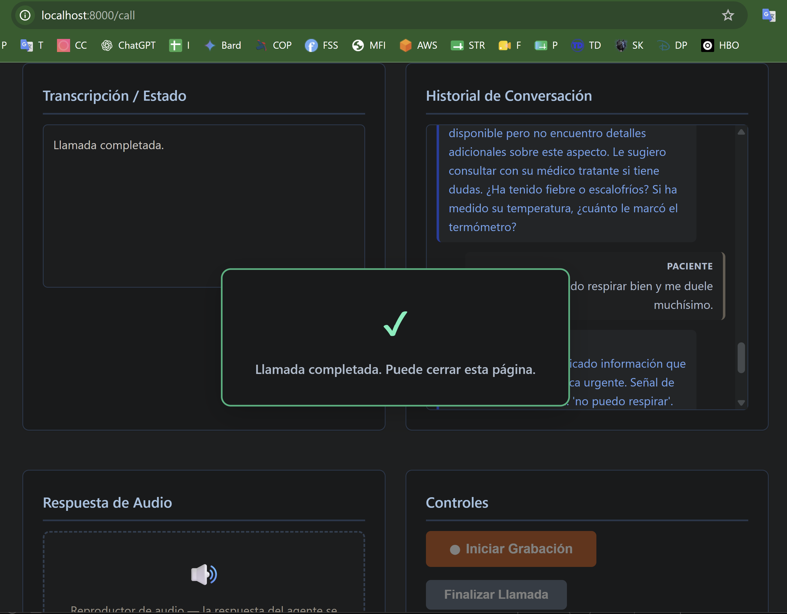
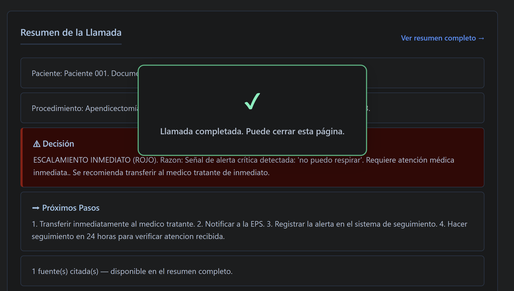
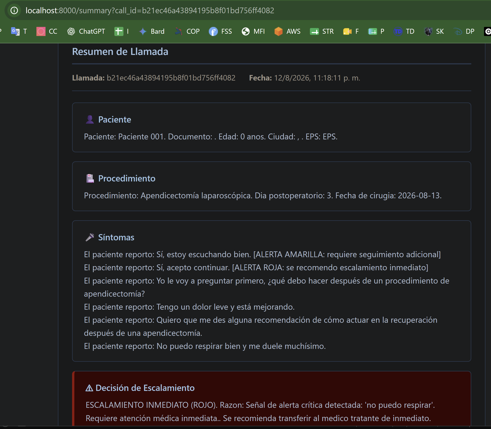
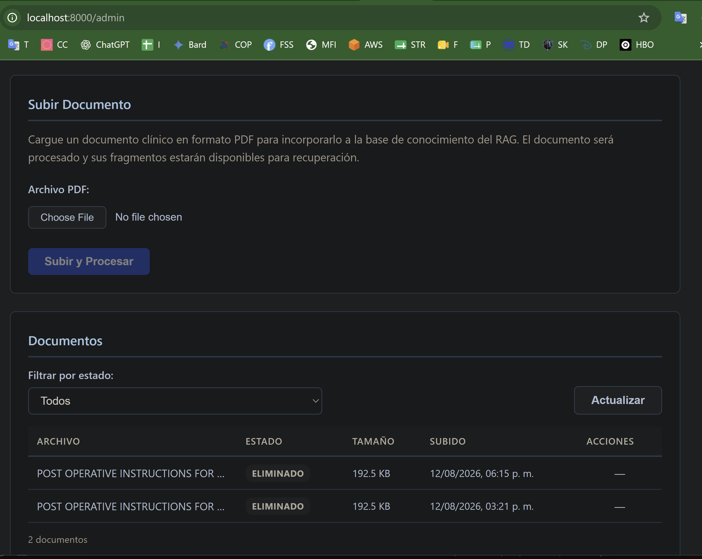
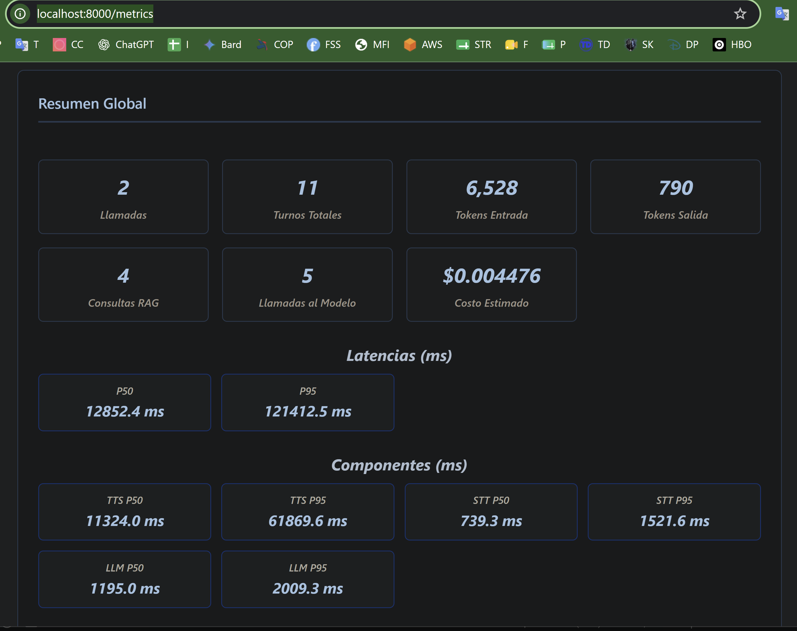
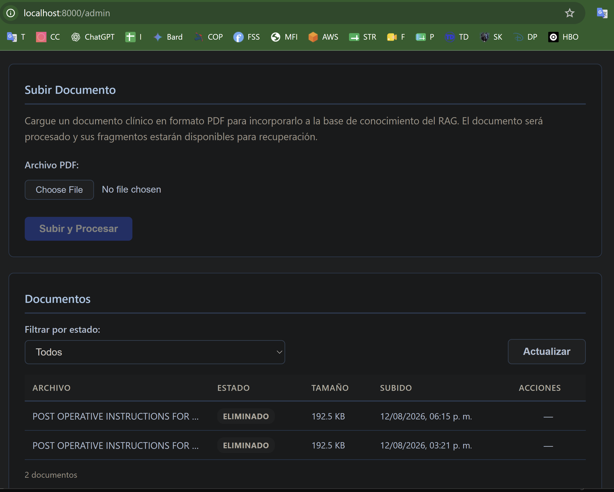
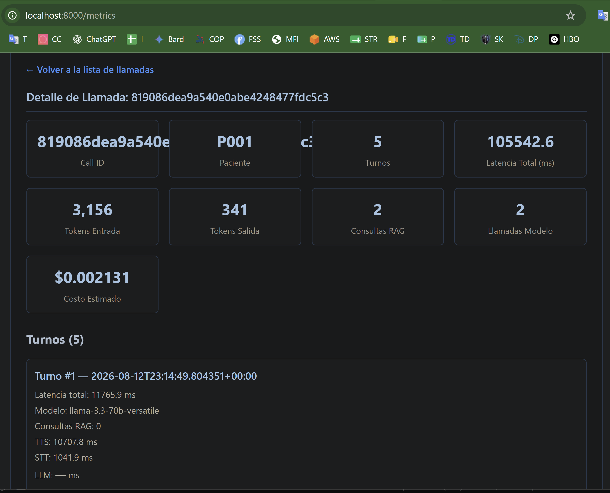
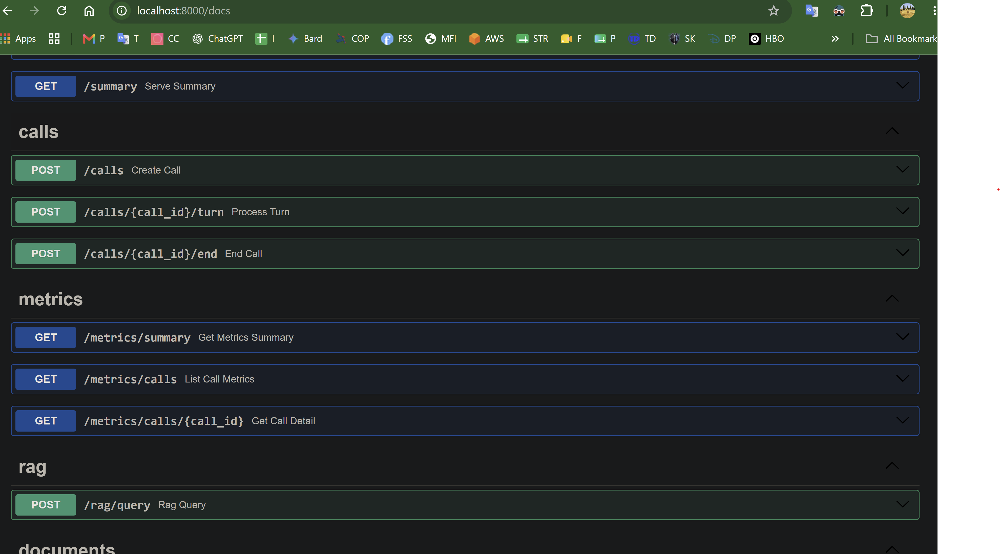

# Capturas De La Aplicación

Estas capturas muestran el flujo actual de la aplicación ejecutándose localmente.
Los datos clínicos visibles son sintéticos.

## Selección Y Llamada

## Administración Y Resumen

## Métricas

> **Nota:** La métrica de costo estimado de las llamadas fue implementada después
> de la grabación del video de demostración. Por ello algunas capturas del video
> no muestran ese valor, aunque sí aparece en la versión actual de `/metrics`.
